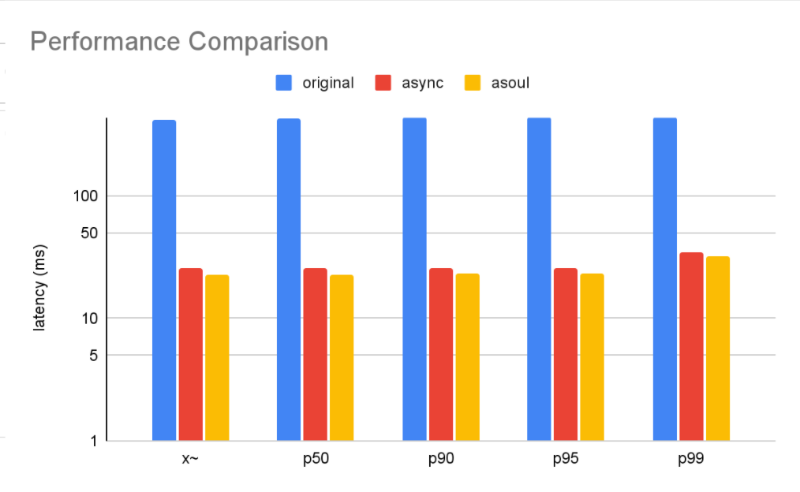

---
title: "ASoul: Applicatives, Monads, and a Future for Rust"
author:
- Mike He
- Jiuru Li
- Yihong Zhang
documentclass: article
geometry:
- margin=0.75in
classoption: twocolumn
...

# Background
<!-- Concurrency is now ubiquitous in today's network programming. In a typical scenario, an application makes requests to remote servers and the program logic will depend on the collected responses. However, the traditional sequential execution model will waste CPU time by waiting for the responses. Therefore, concurrency is introduced to make sure the part of programs not dependent on the server responses can make progress and maximize execution efficiency. Maximizing concurrency without burdens on the developers is still an interesting programming language design problem. -->
Async is a concurrent programming model adopted in Rust and has now been widely used. To use the async model, developers create an encapsulated async block, called future, for each remote data fetch, and let an executor run many futures concurrently. Compared to the multi-processing or multi-threading concurrency model, async does not bear system call overheads and is more lightweight and more efficient. However, there are several problems with the async programming model, potentially preventing it from further adoption compared to multi-threading. For example, API calls need to be asynchronous in order to be run concurrently. Moreover, the executor can only run multiple futures together when they are explicitly used as parameters to specific future calls such as `join!` or `select!`.

Haxl is a concurrency framework developed by Facebook that proposes to use applicatives and monads to write concurrency-aware program with out directly expressing the (in)dependencies. Taking advantages of Haskell's type system, Haxl is able to automatically batch requests together whenever they could be executed in parallel. 

In this project, we propose ASoul\footnote{\textbf{AS}ync \textbf{O}ptimal, \textbf{U}ser-friendly \textbf{L}ibrary.}, an alternative concurrency model for Rust based on Haxl. Our programming model allows mixing asynchronous and synchronous calls in the same program and schedule concurrent tasks automatically without explicit calls to future APIs like `join!` or `select!`. At the core of our programming model is applicative functors, or applicatives, and monads. In fact, monads have been long known in the functional programming community for being able to express concurrency, and the async model in Rust can be seen as syntactic sugars around the concurrency monad. Following Haxl, we propose to use applicative functors to express tasks that do not has dependencies and can be executed concurrently. The use of applicatives allows us to batch independent tasks via standard applicative operations like `bind` and `ap`. We implement a `fetch!` macro as a syntactic indirection that reduce the complication introduced by calling applicative operations. 
<!-- However, this will require the user to manually call these applicative operations, causing mental burdens. The async model in Rust eases this problem by adding new syntactic constructs like `await` and `async`, which is not practical for us. Therefore, we propose to use Rust's macro mechanism to mitigate the syntactic indirections as much as possible. -->

# Design of ASoul

#### `Fetch<T>`.
We use trait `Request<T>` to represent an atomic async request of type `T`, and use `Fetch<T>` to represent a program of type `T` that could possibly make several requests. First, any plain Rust value of type `T` and any struct implementing `Request<T>` can be lifted into a `Fetch<T>`:
```rust
fn pure(a: T) -> Fetch<T>
fn new<R: Request<T>>(request: R) -> Fetch<T>
```
These are the "leaves" of a `Fetch<T>` program.

Moreover, `Fetch<T>` forms a monad, because the following operation can be implemented for `Fetch<T>`:
```rust
fn bind<T, U>(x: Fetch<T>, 
    k: impl FnOnce(T) -> Fetch<U>
) -> Fetch<U>
```
This abstraction essentially says that, give me a program of type `Fetch<U>` that is dependent on the choice of value `T` and a program of type `Fetch<T>`, I can tell you how to compose both programs and give you a program of type `Fetch<U>` without any dependency. This intuitively explains why monad is a good abstraction for sequential execution.

Finally, `Fetch<T>` is also an applicative functor:
<!-- ```rust
fn fmap<T, U>(x: Fetch<T>, 
    f: impl FnOnce(T) -> U
) -> Fetch<U>
``` -->
```rust
fn ap<T, U>(
    f: Fetch<impl FnOnce(T) -> U>, 
    x: Fetch<T>
) -> Fetch<U>
```

`ap` takes a program that computes a (higher-order) function from `T` to `U` and a program that computes to `T` and produces a program that computes to `U`. The `ap` operator describes the nature of concurrent computation. This can be more clearly demonstrated by a variant of it, `ap2`, which can be implemented using `ap`:
```rust
fn ap2<T1, T2, U>(
    f: Fetch<impl FnOnce(T1, T2) -> U>, 
    x: Fetch<T1>, y: Fetch<T2>
) -> Fetch<U>
```
`ap2` reads: give me a program that computes a function from `(T1, T2)` to `U` and individual programs that compute to `T1` and `T2`, I can give you a program that computes to `U`. In this case, the implementation of `ap` can freely parallelize the computation of `Fetch<T1>` and `Fetch<T2>` (and `Fetch<impl FnOnce(T1, T2) -> U>`), because there is no inter-dependencies between them.

It turns out these are all we need to express all the features we want: sequential composition, method calls, and other advanced control flow. Once we build a program with the appropriate applicative and monadic API calls, all the (in)dependencies between requests are implicitly constructed.

An acute reader may notice that all monads are applicatives, and applicatives can be automatically implemented using operations on monads, so why do we even call them out? We do this, following Haxl, because of the restrictions specific to applicatives. In this case, compositions of applicatives are known to be parallelizable, so a more efficient implementation can be derived.

#### Batching requests into layers.

Now we have abstractions for expressing sequential and concurrent programs, but we still need a way to perform these requests that utilizes the dependency information to maximize concurrency. We use the following:

* A `Fetch<T>` is a lazily evaluated wrapper over two possible status: 
  * `Done(T)`: the value of this program has been computed and stored.
  *  `Blocked(Vec<AbsRequest>, Fetch<T>)`: the program is blocked by a vector of request (`AbsRequest` is an abstract struct of `Request<T>`s for all `T`). Once the all the requests from the vector are performed, The blocked requests can be further computed by looking into the second argument of type `Fetch<T>`, which may itself be blocked. This creates a layered view of the requests, such that concurrent requests are layered at the same level.
* To aggregate this layered structure, we utilize the applicative and monadic APIs: 
  * For applicative operations, we simply merge the two lists of blocked `AbsRequest`s. 
  * For monadic operations, we put the blocked requests from the depended value to be one layer up than the dependent computation.

#### Implementation in Rust.

Although our design follows Haxl, which is implemented in Haskell, we need to adapt the design to features compatible in Rust. In particular, since we don't need the typeclass definition of structures but only one specific instance of monad and applicative, we simply implement them as structs and traits with applicative-like and monadic-like interfaces. Moreover, programming in Haxl or Ruxl requires a monadic programming style, which Haskell has nice supports of and otherwise will be very tedious, so we also implement a `fetch!` macros over Ruxl for easier programming.

#### Other features.

We also implemented exceptions as in the Haxl paper, which can be used for error handling, e.g., when the fetched data are inconsistent or a network error happens. Our design also allows a very modular executor. Currently, we implemented the concurrent execution using the parallel iterator library provided by rayon, which internally uses a thread pool.

# Evaluation
We evaluate ASoul with the load generator from Lab 3 and compare the latency caused by X. We also compared the beauty between implementation in ASoul and Rust's `futures` library\footnote{Code fragments are listed in the Appendix}. Our evaluation shows that the efficiency of concurrent programs in ASoul is comparable, even better, than using the `async` and `await` constructs. 

#### Setup.
We started a 16-thread Chirp kv-store from lab 3 with a pre-populated timed local storage. The storage was made using `mk_local_storage` with 200 users, 40 followers per user, 20 posts per user, 200 message length, and 123432 as the seed. 

Since Chirp lab does not have an async RPC implementation, we had to implement our own using `remote::make_request` and `async_op::send`. 

#### Workload.

Our testing workload is fetching one latest user page of a random user, while logged in as another random user, without caching. We repeated the run 100 times for the original fetch in lab 3 (without caching), the async implementation, and the Asoul implementation. 

#### Results.

Original fetching took 414 milliseconds on average; async implementation took 26 milliseconds; Asoul implementation took 23 milliseconds. 

Since the original fetching is single-threaded, the async and asoul implementations are order-of-magnitude faster than it. Our implementation slightly outruns the async one. We suspect that the async executor has more overhead. 

For more detailed results, see Appdendix. 

# Future Work
#### Applicative Do.
Presentely, though ASoul simplifies the concurrency construct, we are leveraging hardcoded macros to batch the requests, which still requires manual effort. To address this issue, we would extend `fetch!` macro to an applicative do. Applicative Do is a syntactic indirection provided by Haskell that enables programmers write straight line code while constructing concurrency-aware program by keeping a record of monadic binds and lifting them automatically into a batched request. This feature could be expressed leveraging the meta-programming facilities of Rust macro. 

#### Caching
In Haxl paper, the authors implemented a cache store for requests, but we did not implement it due to the time constraint. 
<!-- # Reference -->
<!-- \newpage -->

# Appendix
## Macros and Interfaces
#### `fetch!`.
Similar to `do` notation in Haskell, `fetch!` simplifies the monadic construction of `Fetch<T>`. The core is `<-`, an infix operator that takes a variable `x` and a `Fetch<T>` and `bind` the data of type `T` wrapped in `Fetch` to `x`, which could be used in future `bind`s.

#### `sequence`.
`sequence` use an `Iterator` of type `Fetch<T, E>` to construct a `Fetch<Vec<T>, E>`, by folding the iterator and lifting each `Fetch` inside it. 

#### `lift`.
Similar to `join` in async programming, `lift` combines two `Fetch` with the same error type, and output a `Fetch` that runs them concurrently.

#### `pure`.
Lifts any value of type `T` to `Fetch<T>`.

#### `map`.
Similar to `fmap` in Haskell. Lifts a mapping of type `A` to `B` into a morphism from `Fetch<A>` to `Fetch<B>`.

#### `ap`.
`ap` uncurries `map` and takes a pair of mapping from `A` to `B` and an object with type `Fetch<A>`, returns a result of type `Fetch<B>`.

## Evaluation Results

As shown in the figure above, the performance of ASoul is comparabily efficient as built-in async library of Rust, but ASoul requires less knowledge from its users about the part of the programs that executes in parallel.
